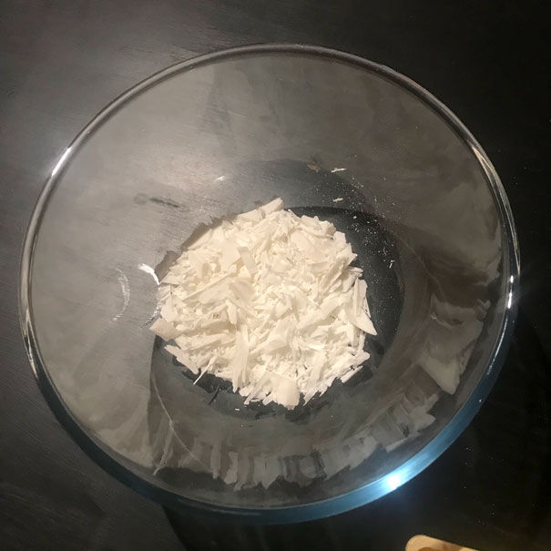
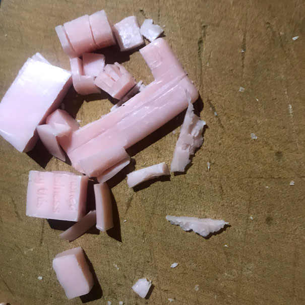
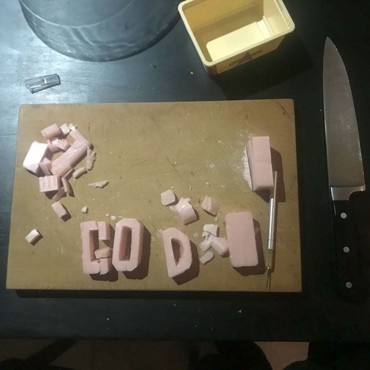
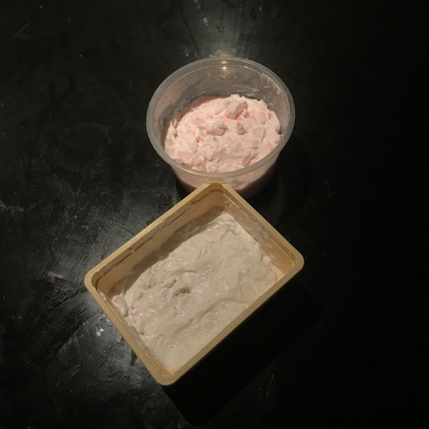
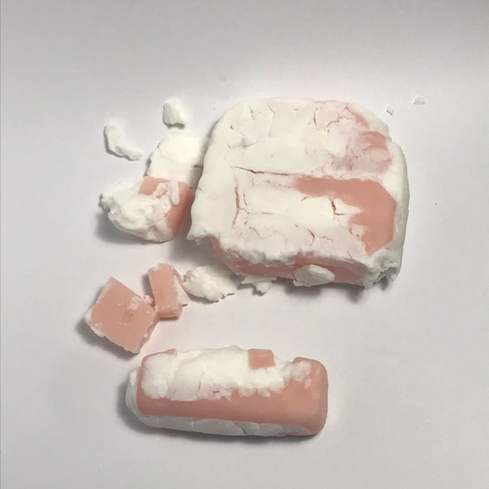
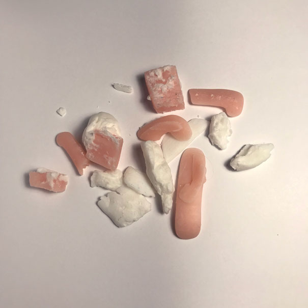

# A Prayer ~~You Can Say With~~ That Falls Apart In Your Hands

The plan:
- Chop up a bar of white dove soap
- Chop up the pink soap into letters, a poem:
> FEEL THE LIGHT  
RUN THROUGH ME  
EVERY DAY  
- Melt down the white soap
- Set the letters into the white soap, as a whole bar
- Document the revealing of the poem as I use the soap
  
## Chop chop
Chopped up the white soap 

## chop chop chop
Chopped up the pink soap. My initial designs were far too ambitious.

  

I had to crop it down to a 3 letter prayer.

## Melt and pour
I melted them in a pan and set them into plastic containers succesfully - pink soap fragments were re-set too.

## A Prayer that falls apart in your hands
Ultimately, I hit 2 main issues
1. Couldn't get the letters fine enough to be meaningful or beautiful
2. Chopped soap doesn't set consistently, it needed to be blended up or I shouldve bought actual melt and pour soap  

I ran into a number of limitations with this first attempt. The material was difficult, brittle and not very malleable. 
I think this is what happens when I try to use cheap and lazy work arounds. 
Part of creating art is being familiar with the material, and I was not at all. 

## Conclusion
I intend to return at some point, to try to pray some more. The next step is to purchase some actual soap products, as in pourable soap and moulds and devise an elegant method to describe the poem in the soap. I have used the soap anyway, picking out the pieces as it disintegrates further with each wash.

